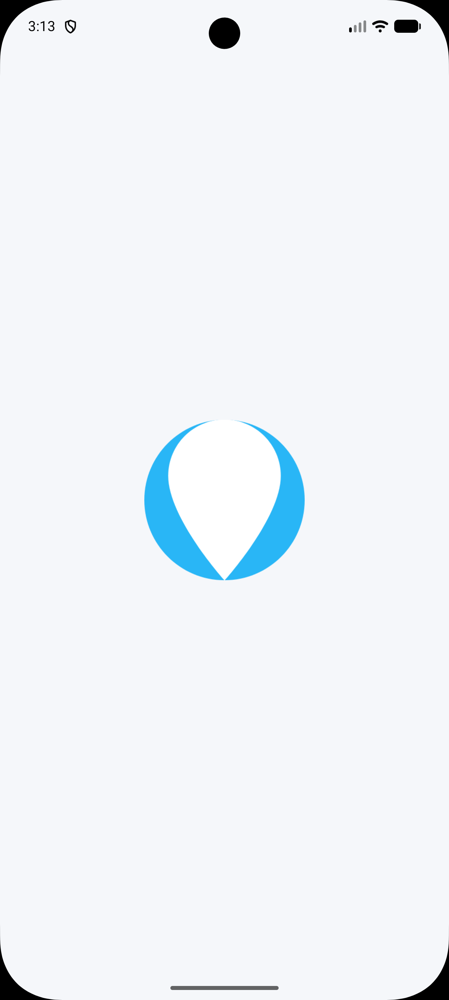
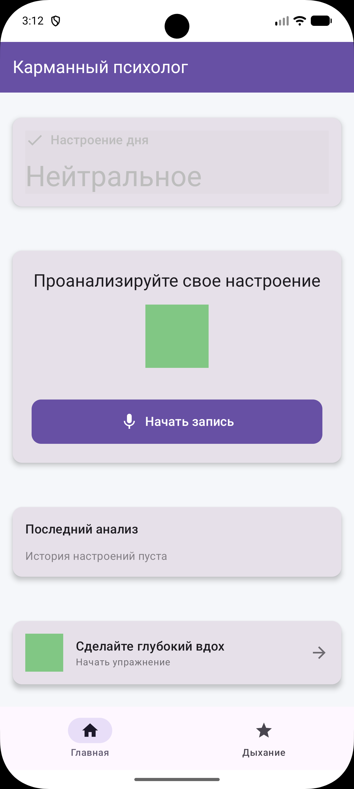

# Карманный психолог (Pocket Psychologist)

Анализ настроения по голосу с помощью ML Kit

## Описание

Приложение анализирует тембр и скорость речи пользователя, определяет настроение и предлагает дыхательные упражнения. Фишка: виджет «Настроение дня» и вибрация в ритме успокаивающего сердечного ритма.

## Структура проекта

```
PocketPsychologist/
├── app/
│   ├── src/main/
│   │   ├── java/com/zx_tole/pocketpsychologist/
│   │   │   ├── ui/                      # UI компоненты
│   │   │   │   ├── theme/              # Темы и цвета
│   │   │   │   ├── home/               # Главный экран
│   │   │   │   ├── breathing/          # Экран дыхательных упражнений
│   │   │   │   └── viewmodel/          # ViewModels
│   │   │   ├── data/                   # Данные и репозитории
│   │   │   │   ├── model/              # Модели данных
│   │   │   │   ├── repository/         # Репозитории
│   │   │   │   └── repository/
│   │   │   ├── voice/                  # Голосовой анализ
│   │   │   ├── service/                # Службы
│   │   │   ├── widget/                 # Виджеты
│   │   │   └── di/                     # DI (Hilt)
│   │   ├── res/                        # Ресурсы
│   │   │   ├── layout/                 # Макеты
│   │   │   ├── values/                 # Строки, цвета, темы
│   │   │   ├── xml/                    # XML конфиги
│   │   │   └── drawable/               # Иконки
│   │   └── AndroidManifest.xml
│   └── build.gradle.kts
├── build.gradle.kts
├── settings.gradle.kts
└── gradle/libs.versions.toml
```

## Зависимости

- AndroidX Core KTX
- Material Components
- Jetpack Compose (BOM)
- Lifecycle ViewModel & Runtime
- Kotlin Coroutines
- Room Database
- WorkManager
- Hilt (DI)
- AndroidX Activity Compose

## Разрешения

- RECORD_AUDIO - запись голоса
- VIBRATE - вибрация для упражнений
- POST_NOTIFICATIONS - уведомления
- FOREGROUND_SERVICE - фоновый сервис

## Функции

1. **Анализ голоса**: Запись речи и определение настроения
2. **Виджет настроения**: Отображение последнего настроения на главном экране
3. **Дыхательные упражнения**: Анимированное упражнение с вибрацией
4. **История**: Сохранение истории настроений в базе данных

## Использование

1. Запустите приложение
2. Нажмите кнопку "Начать запись"
3. Проговорите что-нибудь в течение 30 секунд
4. После анализа увидите свое настроение
5. Используйте дыхательное упражнение для расслабления
6. Добавьте виджет "Настроение дня" на главный экран

## Настройка

Для сборки проекта требуется:
- Android Studio Hedgehog или новее
- JDK 11 или новее
- Android SDK с API 36

## Важные файлы

### Ключевые Kotlin файлы
- `ui/HomeScreen.kt` - главный экран приложения
- `voice/VoiceAnalyzer.kt` - анализатор голоса
- `data/repository/MoodRepository.kt` - репозиторий настроений
- `ui/viewmodel/HomeViewModel.kt` - ViewModel для главного экрана

### Ресурсы
- `res/values/strings.xml` - строки интерфейса
- `res/values/colors.xml` - цвета темы
- `res/values/themes.xml` - темы приложения
- `res/xml/mood_widget_info.xml` - конфигурация виджета

### Конфигурация
- `gradle/libs.versions.toml` - версии зависимостей
- `app/build.gradle.kts` - конфигурация сборки

## Планы развития

- Интеграция с ML Kit Voice Match API для более точного анализа
- Классификация настроений с помощью кастомной модели
- Интеграция с Google Fit для отслеживания состояния
- Экспорт истории настроений в PDF
- Уведомления и напоминания о дыхательных упражнениях

## Лицензия

Этот проект создан в образовательных целях.

| Screenshots |
|-------------|
|  |
|  |
